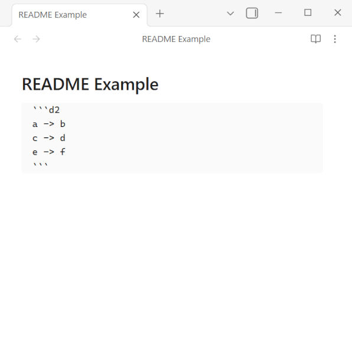
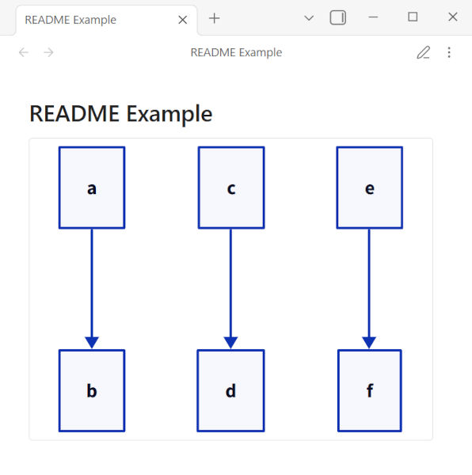

# D2 Standalone

D2 Standalone is an unofficial [Obsidian](https://obsidian.md/) plugin that lets you render [D2](https://d2lang.com/) diagrams directly in your vault — no D2 installation required, fully cross-platform.  
Unlike the official D2 plugin, this plugin uses the official D2 JavaScript library to render diagrams entirely in-process, so it works out of the box on any machine without any additional setup.

Disclaimer: This is an independent, community-made plugin. It is not affiliated with, endorsed by, or supported by Terrastruct, the creators of D2.

This plugin is built using the [obsidian-sample-plugin](https://github.com/obsidianmd/obsidian-sample-plugin) template.

## Usage

Write your D2 diagrams in markdown code blocks with the language identifier `d2`.

|Markdown|Rendered|
|---|---|
|||

## Configuration

If you want to choose a layout engine and other options, add a d2-config block inside your d2 code block in the markdown file.  
The example below shows the format.

````markdown
```d2
vars: {
  d2-config: {
    layout-engine: elk # dagre or elk
    theme-id: 300
    dark-theme-id: 200
    theme-overrides: {
      B1: "#ff0000"
      B2: "#00ff00"
    }
  }
}

a -> b
```
````

Sketch options can only be configured in the settings.

The TALA layout engine is not supported.

## License

This project is licensed under the GNU General Public License v3.0. See the [LICENSE](LICENSE) file for details.
